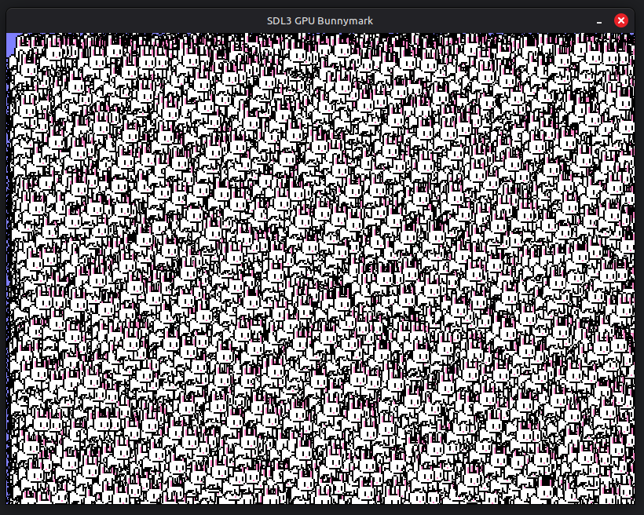

# bunnymark



A collection of bunnymark examples using various rendering APIs:
- SDL_gpu
- SDL3 Renderer
- SDL3 GPU API
- bgfx

I created these examples as a way to learn about and benchmark these APIs.
They were only tested on Linux, and may not work out of the box on other platforms.

## Prerequisites
- C++20+
- CMake 4.0+

## Setup
```shell
git clone --recurse-submodules https://github.com/hsanger/bunnymark.git
cd bunnymark
mkdir build && cd build
cmake ..
cmake --build .
```

## Running
```shell
./bunnymark_sdl2_gpu
./bunnymark_sdl3_gpu
./bunnymark_sdl_renderer
./bunnymark_bgfx
./bunnymark_bgfx_simple
```

## Credits
SDL GPU API tutorials:
- https://moonside.games/ (repo: https://github.com/TheSpydog/SDL_gpu_examples)
- https://www.jonathanfischer.net/gpu-by-example/ (repo: https://github.com/mohiji/gpu-by-example)

This site for the bunny pixel art: https://pixelartmaker.com/art/0fe4e7fd9d072e2
